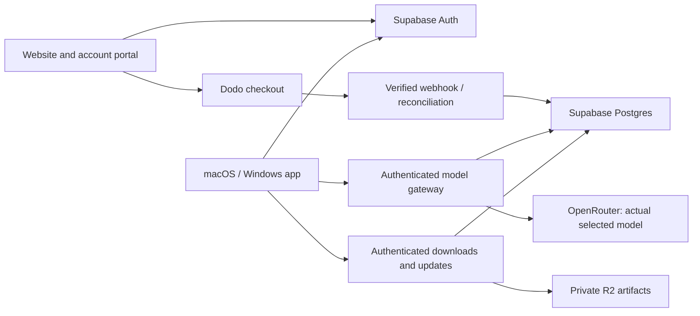

# Unlimit Code implementation plan

The public application fork and a private platform service are separate products to maintain. Preserve the upstream coding engine and project formats; add controlled branding, independent distribution and managed account access. Supabase handles product accounts and relational data. OpenRouter stays behind our service, so signing in replaces the customer's model-key setup.

## System boundaries

The desktop continues to read files, run tools and manage coding sessions locally. The service authenticates individual model requests and streams the provider response. It must not move the agent loop into a long-running Vercel request.

Supabase login identifies the customer. It is not a universal credential for their GitHub, MCP, or other external integrations. Those integrations retain their own consent and token requirements. Product-managed model access has no customer provider/key-entry screen; custom agents, tools and workflows remain available. Company model keys are never copied into the app, customer database rows or public code.

## Fork and upstream cycle

1. Keep `upstream` pointing to `anomalyco/opencode` and `origin` to `raj199108/unlimited-code`. Product branch: `main`; implementation/integration branches: `codex/*`.
2. Pin a stable release and record its exact SHA separately from our product version. Initial baseline: v1.18.32, `545f51d26cc39a907d2867492d498d9607ea5fa4`.
3. Apply reviewed display-string rules and checksummed logo/theme overlays. Preserve internal imports, configuration keys and upstream license notices. Inventory unresolved technical references, external URLs and binary assets separately.
4. Every six hours or manually, discover the newest official stable release, merge it in an integration branch, install its locked dependencies, reapply branding and run checks. Unknown branding, new workflows, modified overlays or merge conflicts stop integration.
5. Open a draft PR after those checks pass. Review the diff and run managed-account/provider acceptance plus desktop builds. Promote deliberately. A bot never merges or publishes a release automatically.
6. Keep Anomaly's publishing/deployment/triage workflows archived outside `.github/workflows`. Configure a narrowly scoped `UPSTREAM_SYNC_TOKEN` so generated PRs trigger CI. Enable the schedule only after the workflow is on the default branch and this credential is configured.

Initial automated checks are intentionally narrower than release acceptance. Installer, native-icon, real model, sign-in and update tests remain launch gates even when branding checks pass.

## Implementation sequence and acceptance

### 1. Repeatable foundation

Deliver the fork, source attribution, approved icon/fonts, deterministic text replacement, Paper/Ink themes, drift tests and an inventory. Typecheck changed application packages. Review each shipped surface, including raster assets and native installers. Give the app its own IDs, URL scheme and data directory before running customer builds alongside OpenCode. Do not globally rename package identifiers.

### 2. Dedicated Supabase project

Create the new project in the selected Supabase organization/region; use separate production and preview configuration. Apply versioned migrations, enable production email delivery and exact callback allowlists. The web portal uses SSR sessions. Desktop/CLI use browser authorization code + PKCE with a public client and OS credential storage, refresh rotation and logout/revocation handling. Verify two unrelated accounts cannot read or change each other's records.

### 3. Paid access and model gateway

Configure one monthly Dodo bundle once domain, price and currency are decided. Bind checkout to the verified account and a server-chosen product. Verify raw-body signatures, deduplicate events, and reconcile subscription state with Dodo rather than trusting delivery order. Confirm the first payment before enabling access; test delayed payment, renewal, cancellation at term, failure, expiry and refunds.

Use actual selected `anthropic/claude-fable-5.1` and `openai/gpt-6-astra` models, subject to launch-time catalog verification. Company OpenRouter funding pays inference. There are no customer message credits/daily quotas. Technical context/transport/provider constraints still apply, and errors must identify the actual failure. No hidden substitute model or fallback. Add content-free cost/usage metadata and company spending alerts.

### 4. Application account integration

Add account login/onboarding, retrieve entitled model selections, and register the managed service as the default provider. Remove customer model-provider connection/key controls consistently in app, TUI, CLI and settings. Prevent project config from turning our company key into arbitrary proxy access; the gateway's model catalog remains authoritative. Preserve MCP/tool setup, custom workflows, agents and project formats. Test streaming tool calls, reasoning, cancellation, reconnects and long coding sessions against real providers.

### 5. Paid downloads and independent releases

Host portal/API on Vercel and installers/update metadata in private R2 storage. Check active paid access before issuing short-lived downloads. Implement authenticated updater requests and Range support without leaking tokens across redirects. Source remains public: paid official distribution is an account service, not a claim that nobody can compile the source.

Build the engine and desktop from the exact fork revision. Package macOS arm64/x64 and Windows x64/arm64; verify upstream tooling supports each target and test on native runners. Use independent Developer ID/notarization, Authenticode and installer identities. Production builds fail if signing is missing. Reject unsigned updates and downgrades. Upload verified artifacts before manifests, separate beta/stable feeds and test upgrades from the previous signed version.

### 6. Launch rehearsal and operation

Run signup → confirmed payment → official download → desktop sign-in → selected real model → tool execution. Test expired/revoked access and reinstall/refresh. Rehearse an upstream update that succeeds and another that fails safely. Monitor payment lag, inference failures, costs, downloads and update failures. Promote the verified beta through a reviewed release.

## Current source of truth

`IMPLEMENTATION_CHECKLIST.md` records completed and pending work with verification evidence. Domain and monthly price/currency remain deliberately undecided. Missing live credentials or a successful local test must never be represented as a production launch.
